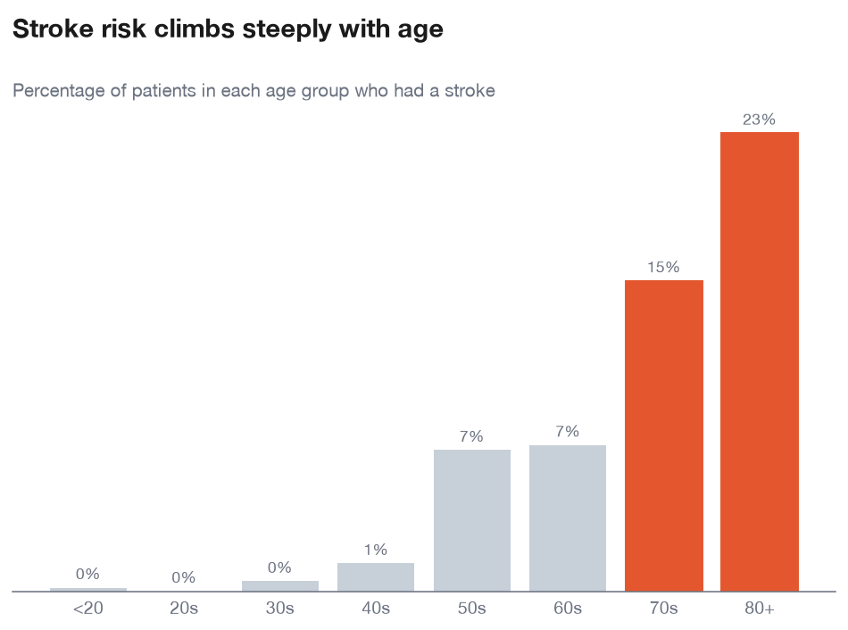
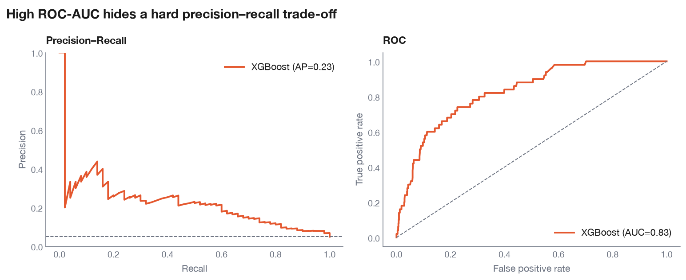
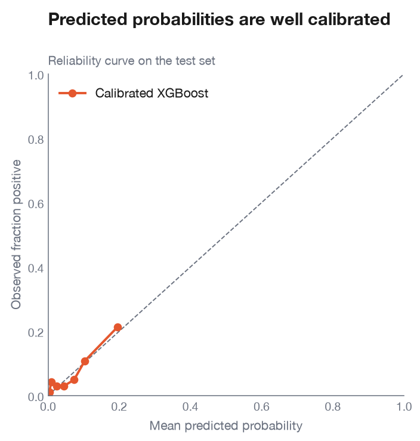
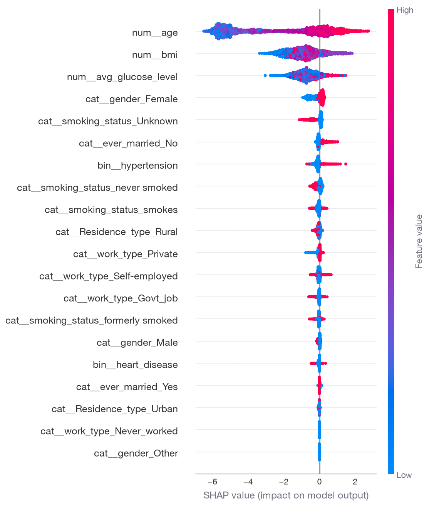
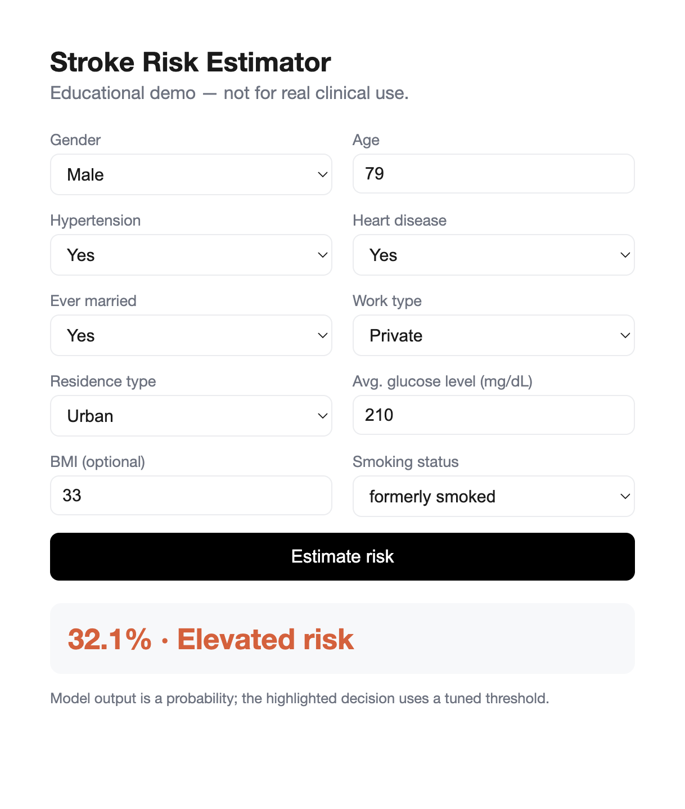

# Stroke Risk

[](https://github.com/drkaziu/stroke-risk/actions/workflows/ci.yml)

Predicting stroke risk from clinical and demographic features — built as a
professional, reproducible, end-to-end data science project (data pipeline →
EDA → modelling → tuning → deployed API).

> ## ⚠️ Disclaimer
> **This is an educational sample project, not a medical device.**
> It must **not** be used for real diagnosis, screening, or any clinical
> decision. The model is trained on a small public dataset, its probabilities
> are uncalibrated, and its accuracy is limited. Nothing here is medical advice.
> If you have health concerns, consult a qualified clinician.

## What it does

- Cleans and splits the data **without leakage** (all learned steps fit on the training set only).
- Explores the data (EDA) and trains two models — Logistic Regression and XGBoost.
- Tunes hyperparameters and the decision threshold, evaluating on held-out data.
- Serves the chosen model through a small FastAPI app with a web UI.

## Results (honest summary)

Stroke is a rare event (~5% of patients), which makes it genuinely hard to predict.
On the held-out **test set**, the calibrated, tuned XGBoost model reaches roughly:

| Metric | Value |
| --- | --- |
| ROC-AUC | ~0.83 |
| PR-AUC | ~0.23 |
| Recall | ~0.68 |
| Precision | ~0.15 |
| Brier score | ~0.042 |

The high ROC-AUC alongside a low PR-AUC is expected on imbalanced data — which is
why this project leads with PR-AUC and recall rather than accuracy. Probabilities
are **calibrated** (isotonic), so the mean prediction (~0.046) matches the true
stroke rate (~0.049). See the [model card](MODEL_CARD.md) for full details and limitations.

## Highlights

Age is by far the strongest driver of stroke risk:



Performance on the test set — a strong ROC curve masking a hard precision–recall trade-off:



Probabilities are calibrated, so predictions can be read as real risks:



The model's reasoning (SHAP) — age, glucose and BMI dominate:



The deployed demo app:



## Setup

Requires [uv](https://docs.astral.sh/uv/).

```bash
uv sync
```

On macOS, XGBoost needs the OpenMP runtime:

```bash
brew install libomp
```

Place the dataset at `data/dataset.csv` (see [Data](#data) below).

## Train and serve

```bash
uv run python -m stroke_risk.train          # tune, select, save models/stroke_model.joblib
uv run uvicorn app.main:app --reload        # serve at http://127.0.0.1:8000
```

Open http://127.0.0.1:8000 for the UI, or http://127.0.0.1:8000/docs for the API.

## Development

```bash
uv run pytest      # run tests
uv run ruff check  # lint
```

## Project layout

```
src/stroke_risk/   # importable package (data, features, model, tune, train)
app/               # FastAPI serving layer + UI
notebooks/         # EDA, modelling, tuning
tests/             # pytest suite
data/              # raw dataset (not tracked)
models/            # trained artifacts (not tracked)
```

## Data

The dataset is **not included** in this repository. Download the Stroke
Prediction Dataset from Kaggle and place it at `data/dataset.csv`:

<https://www.kaggle.com/datasets/fedesoriano/stroke-prediction-dataset>

**Dataset license:** educational use only; author credit required. It is
redistributed here **nowhere** — you must obtain it from the source above.
See [data/README.md](data/README.md).

## License

Source code is licensed under the [MIT License](LICENSE). The license covers the
code only, **not** the dataset (see [Data](#data)).

## Acknowledgements

This project was developed with the assistance of **agentic AI coding tools**.
AI was used to help scaffold the project, write and refactor code, structure the
analysis, and draft documentation. All design decisions, review, and validation
were done by the author.
